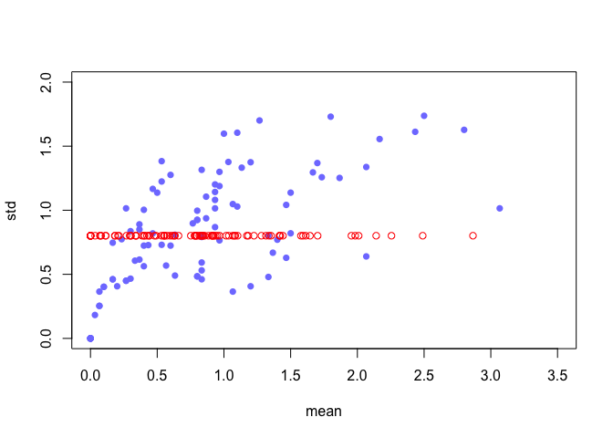

common_value_auctions
================

# Instalation

``` r
rm(list=ls())
```

``` r
library(reticulate)
library(MASS)
library(rstan)
library(shape)
library(tidyr)
require(visdat)
library(ggplot2)
library(dagitty)
library(gtools)
library(ellipse)
library(data.table)
library(tidyverse)
library(rethinking)
```

``` r
options(mc.cores = parallel::detectCores())
rstan_options(auto_write = TRUE)
```

``` python
import matplotlib.pyplot as plt
import numpy as np
import arviz as az
```

# Load data

``` r
path <- "/Users/mac/Documents/1. Chapman/2. MSBCE/3. Fall 2021/CS 686 - Bayes Stats/Common value auction/com_value_survey.csv"
df_raw <- read.csv(path,header=TRUE)
```

``` r
vis_dat(df_raw)
```

<!-- -->

``` r
df <- copy(df_raw[complete.cases(df_raw$Gender,df_raw$Risk),])
```

``` r
df$uid = as.numeric(factor(df$SubId))
df$female = ifelse(df$Gender == "Female",1,0)
df$male = ifelse(df$Gender == "Male",0,1)
df$english = ifelse(df$Institution == "English",1,0)
df$crt = df$CRT1_Eval + df$CRT2_Eval + df$CRT3_Eval
df$prob = df$Prob1_Eval + df$Prob2_Eval + df$Prob3_Eval
df$risk = df$Risk/50 - 1
df$bought = df$SignalsPurchased - 1
```

``` r
row.names(df) <- seq(1:nrow(df))
n_subjects = length(unique(df$uid))
```

``` r
means <- df %>% group_by(uid) %>% summarise(avg = mean(bought), std = sd(bought))
means <- as.data.frame(means)
```

# 1. Pooled models

## A statistical model

$$
B\_{i} \\sim Normal(\\mu\_{i}, \\sigma)\\\\
\\mu\_{i} = \\alpha + \\beta\_{F}F + \\beta\_{E}E + \\beta\_{C}C + \\beta\_{P}P + \\beta\_{R}R\\\\
\\alpha \\sim Normal(2,1)\\\\
c(\\beta\_{F},\\beta\_{E},\\beta\_{C},\\beta\_{P},\\beta\_{R}) \\sim Normal(0,1)\\\\
\\sigma \\sim Exponential(1)
$$
## Fit the model

``` r
dlist <- list(
  N = nrow(df),
  F = df$female,
  E = df$english,
  C = df$crt,
  P = df$prob,
  R = df$risk,
  B = df$bought
)
```

``` r
code_m1 <- "
data{
  int N;
  vector[N] B;
  vector[N] R;
  int F[N];
  int E[N];
  int C[N];
  int P[N];
}
parameters{
  real<lower=0> sigma;
  real a;
  real bF;
  real bE;
  real bC;
  real bP;
  real bR;
}
model{
  vector[N] mu;
  sigma ~ exponential(1);
  a ~ normal(2,1);
  bF ~ normal(0,1);
  bE ~ normal(0,1);
  bC ~ normal(0,1);
  bP ~ normal(0,1);
  bR ~ normal(0,1);
  for(i in 1:N){
    mu[i] = a + bF*F[i] + bE*E[i] + bC*C[i] + bP*P[i] + bR*R[i];
  }
  B ~ normal(mu, sigma);
}
"
```

``` r
m1 <- stan(model_code=code_m1,data=dlist,chains=4,cores=4)
```

    ## Running /Library/Frameworks/R.framework/Resources/bin/R CMD SHLIB foo.c
    ## clang -mmacosx-version-min=10.13 -I"/Library/Frameworks/R.framework/Resources/include" -DNDEBUG   -I"/Library/Frameworks/R.framework/Versions/4.1/Resources/library/Rcpp/include/"  -I"/Library/Frameworks/R.framework/Versions/4.1/Resources/library/RcppEigen/include/"  -I"/Library/Frameworks/R.framework/Versions/4.1/Resources/library/RcppEigen/include/unsupported"  -I"/Library/Frameworks/R.framework/Versions/4.1/Resources/library/BH/include" -I"/Library/Frameworks/R.framework/Versions/4.1/Resources/library/StanHeaders/include/src/"  -I"/Library/Frameworks/R.framework/Versions/4.1/Resources/library/StanHeaders/include/"  -I"/Library/Frameworks/R.framework/Versions/4.1/Resources/library/RcppParallel/include/"  -I"/Library/Frameworks/R.framework/Versions/4.1/Resources/library/rstan/include" -DEIGEN_NO_DEBUG  -DBOOST_DISABLE_ASSERTS  -DBOOST_PENDING_INTEGER_LOG2_HPP  -DSTAN_THREADS  -DBOOST_NO_AUTO_PTR  -include '/Library/Frameworks/R.framework/Versions/4.1/Resources/library/StanHeaders/include/stan/math/prim/mat/fun/Eigen.hpp'  -D_REENTRANT -DRCPP_PARALLEL_USE_TBB=1   -I/usr/local/include   -fPIC  -Wall -g -O2  -c foo.c -o foo.o
    ## In file included from <built-in>:1:
    ## In file included from /Library/Frameworks/R.framework/Versions/4.1/Resources/library/StanHeaders/include/stan/math/prim/mat/fun/Eigen.hpp:13:
    ## In file included from /Library/Frameworks/R.framework/Versions/4.1/Resources/library/RcppEigen/include/Eigen/Dense:1:
    ## In file included from /Library/Frameworks/R.framework/Versions/4.1/Resources/library/RcppEigen/include/Eigen/Core:88:
    ## /Library/Frameworks/R.framework/Versions/4.1/Resources/library/RcppEigen/include/Eigen/src/Core/util/Macros.h:628:1: error: unknown type name 'namespace'
    ## namespace Eigen {
    ## ^
    ## /Library/Frameworks/R.framework/Versions/4.1/Resources/library/RcppEigen/include/Eigen/src/Core/util/Macros.h:628:16: error: expected ';' after top level declarator
    ## namespace Eigen {
    ##                ^
    ##                ;
    ## In file included from <built-in>:1:
    ## In file included from /Library/Frameworks/R.framework/Versions/4.1/Resources/library/StanHeaders/include/stan/math/prim/mat/fun/Eigen.hpp:13:
    ## In file included from /Library/Frameworks/R.framework/Versions/4.1/Resources/library/RcppEigen/include/Eigen/Dense:1:
    ## /Library/Frameworks/R.framework/Versions/4.1/Resources/library/RcppEigen/include/Eigen/Core:96:10: fatal error: 'complex' file not found
    ## #include <complex>
    ##          ^~~~~~~~~
    ## 3 errors generated.
    ## make: *** [foo.o] Error 1

``` r
precis(m1)
```

    ##               mean         sd        5.5%        94.5%    n_eff     Rhat4
    ## sigma  1.108036077 0.01464267  1.08491386  1.131302146 3884.699 0.9995058
    ## a      1.284184760 0.06605724  1.17704819  1.387311965 2427.081 1.0016245
    ## bF    -0.466380174 0.04392983 -0.53606324 -0.396317142 3335.256 1.0003613
    ## bE    -0.040940469 0.04241417 -0.10864152  0.027902751 3618.721 0.9999319
    ## bC    -0.007473479 0.01944974 -0.03882498  0.024194763 3749.166 1.0009794
    ## bP    -0.033991339 0.02224049 -0.06938232  0.001077812 2862.143 1.0014228
    ## bR     0.276786933 0.04771396  0.20089688  0.354785618 3653.490 1.0007143

## Posterior predictive checks

``` r
post1 <- extract.samples(m1)
```

``` r
set.seed(1)
N <- dlist$N
B_sim <- matrix(0,nrow=length(post1$a),ncol=N)

for(i in 1:N){B_sim[,i] = rnorm(length(post1$a),mean=post1$a + post1$bR*dlist$R[i] + post1$bP*dlist$P[i] + post1$bC*dlist$C[i] + post1$bE*dlist$E[i] + post1$bF*dlist$F[i], sd=post1$sigma)}

B_sim_mean <- matrix(0,nrow=length(post1$a),ncol=96)
for(i in 1:96){B_sim_mean[,i] = apply(B_sim[,(30*i-29):(30*i)],1,mean)}
```

``` python
preds = np.split(np.array(r.B_sim),96,axis=1)
preds = np.mean(preds, axis=2)
```

``` python
# az.plot_kde(r.means.avg)
# for i in range(50):
#   az.plot_kde(np.array(preds)[:,i], plot_kwargs={'color':'red', 'alpha':0.1}, bw=0.15)
# plt.xlabel("Average bought")
# plt.ylabel("Frequency")
# plt.show()
```

``` r
pred_means <- matrix(0,nrow=96,ncol=30)
for(i in 1:96){pred_means[i,] = apply(B_sim[,(30*i-29):(30*i)],2,mean)}
pred_means <- apply(pred_means,1,mean)
pred_sd <- rep(mean(post1$sigma),96)
```

``` r
#The average of bought signals for each subject across the posterior predictive simulations

plot(NULL, xlim=c(0,3.5),ylim=c(0,2),xlab="mean",ylab="std")
points(x=means$avg,y=means$std,col=col.alpha(rangi2,1),pch=16)
points(x=pred_means, y=pred_sd, col=col.alpha("red",1))
```

<!-- -->

``` r
mus <- matrix(0,96,length(post1$a))
std <- matrix(0,96,length(post1$a))
for(i in 1:96){mus[i,] = apply(B_sim[,(30*i-29):(30*i)],1,mean)}
for(i in 1:96){std[i,] = apply(B_sim[,(30*i-29):(30*i)],1,sd)}
```

``` r
plot(NULL, xlim=c(0,3.5),ylim=c(0,2),xlab="mean",ylab="std")
points(x=means$avg,y=means$std,col=col.alpha(rangi2,1),pch=16)
points(x=mus[,1], y=std[,1], col=col.alpha("red",1))
```

<!-- -->

# 2. Unpooled models

## A statistical model

$$
B\_{i} \\sim Normal(\\mu\_{i}, \\sigma)\\\\
\\mu\_{i} = \\alpha + \\delta\[U\_{i}\] + \\beta\_{F}F + \\beta\_{E}E + \\beta\_{C}C + \\beta\_{P}P + \\beta\_{R}R\\\\
\\alpha \\sim Normal(2,1)\\\\
c(\\beta\_{F},\\beta\_{E},\\beta\_{C},\\beta\_{P},\\beta\_{R}) \\sim Normal(0,1)\\\\
\\sigma \\sim Exponential(1)\\\\
\\delta \\sim Normal(0,0.5)
$$

## Fit the model

``` r
dlist2 <- list(
  N = nrow(df),
  F = df$female,
  E = df$english,
  C = df$crt,
  P = df$prob,
  R = df$risk,
  B = df$bought,
  U = df$uid
)
```

``` r
code_m2 <- "
data{
  int N;
  vector[N] B;
  vector[N] R;
  int F[N];
  int E[N];
  int C[N];
  int P[N];
  int U[N];
}
parameters{
  real<lower=0> sigma;
  real a;
  real bF;
  real bE;
  real bC;
  real bP;
  real bR;
  vector[96] d;
}
model{
  vector[N] mu;
  sigma ~ exponential(1);
  a ~ normal(2,1);
  bF ~ normal(0,1);
  bE ~ normal(0,1);
  bC ~ normal(0,1);
  bP ~ normal(0,1);
  bR ~ normal(0,1);
  d ~ normal(0,0.5);
  for(i in 1:N){
    mu[i] = a + d[U[i]] + bF*F[i] + bE*E[i] + bC*C[i] + bP*P[i] + bR*R[i];
  }
  B ~ normal(mu, sigma);
}
"
```

``` r
m2 <- stan(model_code=code_m2,data=dlist2,chains=4,cores=4)
```

    ## Running /Library/Frameworks/R.framework/Resources/bin/R CMD SHLIB foo.c
    ## clang -mmacosx-version-min=10.13 -I"/Library/Frameworks/R.framework/Resources/include" -DNDEBUG   -I"/Library/Frameworks/R.framework/Versions/4.1/Resources/library/Rcpp/include/"  -I"/Library/Frameworks/R.framework/Versions/4.1/Resources/library/RcppEigen/include/"  -I"/Library/Frameworks/R.framework/Versions/4.1/Resources/library/RcppEigen/include/unsupported"  -I"/Library/Frameworks/R.framework/Versions/4.1/Resources/library/BH/include" -I"/Library/Frameworks/R.framework/Versions/4.1/Resources/library/StanHeaders/include/src/"  -I"/Library/Frameworks/R.framework/Versions/4.1/Resources/library/StanHeaders/include/"  -I"/Library/Frameworks/R.framework/Versions/4.1/Resources/library/RcppParallel/include/"  -I"/Library/Frameworks/R.framework/Versions/4.1/Resources/library/rstan/include" -DEIGEN_NO_DEBUG  -DBOOST_DISABLE_ASSERTS  -DBOOST_PENDING_INTEGER_LOG2_HPP  -DSTAN_THREADS  -DBOOST_NO_AUTO_PTR  -include '/Library/Frameworks/R.framework/Versions/4.1/Resources/library/StanHeaders/include/stan/math/prim/mat/fun/Eigen.hpp'  -D_REENTRANT -DRCPP_PARALLEL_USE_TBB=1   -I/usr/local/include   -fPIC  -Wall -g -O2  -c foo.c -o foo.o
    ## In file included from <built-in>:1:
    ## In file included from /Library/Frameworks/R.framework/Versions/4.1/Resources/library/StanHeaders/include/stan/math/prim/mat/fun/Eigen.hpp:13:
    ## In file included from /Library/Frameworks/R.framework/Versions/4.1/Resources/library/RcppEigen/include/Eigen/Dense:1:
    ## In file included from /Library/Frameworks/R.framework/Versions/4.1/Resources/library/RcppEigen/include/Eigen/Core:88:
    ## /Library/Frameworks/R.framework/Versions/4.1/Resources/library/RcppEigen/include/Eigen/src/Core/util/Macros.h:628:1: error: unknown type name 'namespace'
    ## namespace Eigen {
    ## ^
    ## /Library/Frameworks/R.framework/Versions/4.1/Resources/library/RcppEigen/include/Eigen/src/Core/util/Macros.h:628:16: error: expected ';' after top level declarator
    ## namespace Eigen {
    ##                ^
    ##                ;
    ## In file included from <built-in>:1:
    ## In file included from /Library/Frameworks/R.framework/Versions/4.1/Resources/library/StanHeaders/include/stan/math/prim/mat/fun/Eigen.hpp:13:
    ## In file included from /Library/Frameworks/R.framework/Versions/4.1/Resources/library/RcppEigen/include/Eigen/Dense:1:
    ## /Library/Frameworks/R.framework/Versions/4.1/Resources/library/RcppEigen/include/Eigen/Core:96:10: fatal error: 'complex' file not found
    ## #include <complex>
    ##          ^~~~~~~~~
    ## 3 errors generated.
    ## make: *** [foo.o] Error 1

``` r
precis(m2)
```

    ##              mean         sd        5.5%       94.5%     n_eff     Rhat4
    ## sigma  0.93480142 0.01266137  0.91454673  0.95537181 8676.4311 0.9995402
    ## a      1.30359450 0.16977105  1.02652567  1.57500463  876.3354 1.0031824
    ## bF    -0.46797766 0.11636654 -0.65263923 -0.28208503  851.1660 1.0026776
    ## bE    -0.04485505 0.11018977 -0.21694476  0.13330563  864.3582 1.0015047
    ## bC    -0.01192500 0.04806534 -0.08881919  0.06452135 1069.4320 1.0006522
    ## bP    -0.03926631 0.05837163 -0.13277181  0.05254061  904.2690 1.0041089
    ## bR     0.27427102 0.12825872  0.07013125  0.47595908  921.5844 1.0016732

## Posterior predictive checks

``` r
post2 <- extract.samples(m2)
```

``` r
set.seed(1)
N <- dlist2$N
B_sim2 <- matrix(0,nrow=length(post2$a),ncol=N)

for(i in 1:N){B_sim2[,i] = rnorm(length(post2$a),mean=post2$a + post2$d[,dlist2$U[i]] + post2$bR*dlist2$R[i] + post2$bP*dlist2$P[i] + post2$bC*dlist2$C[i] + post2$bE*dlist2$E[i] + post2$bF*dlist2$F[i], sd=post2$sigma)}

B_sim_mean2 <- matrix(0,nrow=length(post2$a),ncol=96)
for(i in 1:96){B_sim_mean2[,i] = apply(B_sim2[,(30*i-29):(30*i)],1,mean)}
```

``` python
preds = np.split(np.array(r.B_sim2),96,axis=1)
preds = np.mean(preds, axis=2)
pred_means = np.mean(preds, axis=1)
```

``` python
# az.plot_kde(r.means.avg)
# az.plot_kde(pred_means)
# for i in range(50):
#   az.plot_kde(np.array(preds)[:,i], plot_kwargs={'color':'red', 'alpha':0.1}, bw=0.15)
# plt.xlabel("Average bought")
# plt.ylabel("Frequency")
# plt.show()
```

``` r
pred_means <- matrix(0,nrow=96,ncol=30)
for(i in 1:96){pred_means[i,] = apply(B_sim2[,(30*i-29):(30*i)],2,mean)}
pred_means <- apply(pred_means,1,mean)
```

``` r
pred_means <- matrix(0,nrow=96,ncol=30)
for(i in 1:96){pred_means[i,] = apply(B_sim2[,(30*i-29):(30*i)],2,mean)}
pred_means <- apply(pred_means,1,mean)
pred_sd <- rep(mean(post2$sigma),96)
```

``` r
plot(NULL, xlim=c(0,3.5),ylim=c(0,2),xlab="mean",ylab="std")
points(x=means$avg,y=means$std,col=col.alpha(rangi2,1),pch=16)
points(x=pred_means, y=pred_sd, col=col.alpha("red",1))
```

<!-- -->

``` r
mus <- matrix(0,96,length(post2$a))
std <- matrix(0,96,length(post2$a))
for(i in 1:96){mus[i,] = apply(B_sim2[,(30*i-29):(30*i)],1,mean)}
for(i in 1:96){std[i,] = apply(B_sim2[,(30*i-29):(30*i)],1,sd)}
```

``` r
plot(NULL, xlim=c(0,3.5),ylim=c(0,2),xlab="mean",ylab="std")
points(x=means$avg,y=means$std,col=col.alpha(rangi2,1),pch=16)
points(x=mus[,1], y=std[,1], col=col.alpha("red",1))
```

<!-- -->

# 3. Heteroskedasticity

## A statistical model

$$
B\_{i} \\sim Normal(\\mu\_{i}, \\sigma\_{i})\\\\
\\mu\_{i} = \\alpha + \\delta\[U\_{i}\] + \\beta\_{F}F + \\beta\_{E}E + \\beta\_{C}C + \\beta\_{P}P + \\beta\_{R}R\\\\
\\sigma\_{i} = \\sigma \* \\lambda\_{i} \\\\
\\lambda \\sim TruncatedNormal(1,0.2,0.05)\\\\
\\alpha \\sim Normal(2,1)\\\\
c(\\beta\_{F},\\beta\_{E},\\beta\_{C},\\beta\_{P},\\beta\_{R}) \\sim Normal(0,1)\\\\
\\sigma \\sim Exponential(1)\\\\
\\delta \\sim Normal(0,0.5)
$$

## Fit the model

``` r
dlist2 <- list(
  N = nrow(df),
  F = df$female,
  E = df$english,
  C = df$crt,
  P = df$prob,
  R = df$risk,
  B = df$bought,
  U = df$uid
)
```

``` r
code_m3 <- "
data{
  int N;
  vector[N] B;
  vector[N] R;
  int F[N];
  int E[N];
  int C[N];
  int P[N];
  int U[N];
}
parameters{
  real<lower=0> sigma;
  vector<lower=0.05>[96] sigma_lambda;
  real a;
  real bF;
  real bE;
  real bC;
  real bP;
  real bR;
  vector[96] d;
}
model{
  vector[N] mu;
  vector[N] sigmas;
  sigma ~ exponential(1);
  sigma_lambda ~ normal(1,0.2);
  a ~ normal(2,1);
  bF ~ normal(0,1);
  bE ~ normal(0,1);
  bC ~ normal(0,1);
  bP ~ normal(0,1);
  bR ~ normal(0,1);
  d ~ normal(0,0.5);
  for(i in 1:N){
    mu[i] = a + d[U[i]] + bF*F[i] + bE*E[i] + bC*C[i] + bP*P[i] + bR*R[i];
  }
  for(i in 1:N){
    sigmas[i] = sigma * sigma_lambda[U[i]];
  }
  B ~ normal(mu, sigmas);
}
"
```

``` r
m3 <- stan(model_code=code_m3,data=dlist2,chains=4,cores=4)
```

    ## Running /Library/Frameworks/R.framework/Resources/bin/R CMD SHLIB foo.c
    ## clang -mmacosx-version-min=10.13 -I"/Library/Frameworks/R.framework/Resources/include" -DNDEBUG   -I"/Library/Frameworks/R.framework/Versions/4.1/Resources/library/Rcpp/include/"  -I"/Library/Frameworks/R.framework/Versions/4.1/Resources/library/RcppEigen/include/"  -I"/Library/Frameworks/R.framework/Versions/4.1/Resources/library/RcppEigen/include/unsupported"  -I"/Library/Frameworks/R.framework/Versions/4.1/Resources/library/BH/include" -I"/Library/Frameworks/R.framework/Versions/4.1/Resources/library/StanHeaders/include/src/"  -I"/Library/Frameworks/R.framework/Versions/4.1/Resources/library/StanHeaders/include/"  -I"/Library/Frameworks/R.framework/Versions/4.1/Resources/library/RcppParallel/include/"  -I"/Library/Frameworks/R.framework/Versions/4.1/Resources/library/rstan/include" -DEIGEN_NO_DEBUG  -DBOOST_DISABLE_ASSERTS  -DBOOST_PENDING_INTEGER_LOG2_HPP  -DSTAN_THREADS  -DBOOST_NO_AUTO_PTR  -include '/Library/Frameworks/R.framework/Versions/4.1/Resources/library/StanHeaders/include/stan/math/prim/mat/fun/Eigen.hpp'  -D_REENTRANT -DRCPP_PARALLEL_USE_TBB=1   -I/usr/local/include   -fPIC  -Wall -g -O2  -c foo.c -o foo.o
    ## In file included from <built-in>:1:
    ## In file included from /Library/Frameworks/R.framework/Versions/4.1/Resources/library/StanHeaders/include/stan/math/prim/mat/fun/Eigen.hpp:13:
    ## In file included from /Library/Frameworks/R.framework/Versions/4.1/Resources/library/RcppEigen/include/Eigen/Dense:1:
    ## In file included from /Library/Frameworks/R.framework/Versions/4.1/Resources/library/RcppEigen/include/Eigen/Core:88:
    ## /Library/Frameworks/R.framework/Versions/4.1/Resources/library/RcppEigen/include/Eigen/src/Core/util/Macros.h:628:1: error: unknown type name 'namespace'
    ## namespace Eigen {
    ## ^
    ## /Library/Frameworks/R.framework/Versions/4.1/Resources/library/RcppEigen/include/Eigen/src/Core/util/Macros.h:628:16: error: expected ';' after top level declarator
    ## namespace Eigen {
    ##                ^
    ##                ;
    ## In file included from <built-in>:1:
    ## In file included from /Library/Frameworks/R.framework/Versions/4.1/Resources/library/StanHeaders/include/stan/math/prim/mat/fun/Eigen.hpp:13:
    ## In file included from /Library/Frameworks/R.framework/Versions/4.1/Resources/library/RcppEigen/include/Eigen/Dense:1:
    ## /Library/Frameworks/R.framework/Versions/4.1/Resources/library/RcppEigen/include/Eigen/Core:96:10: fatal error: 'complex' file not found
    ## #include <complex>
    ##          ^~~~~~~~~
    ## 3 errors generated.
    ## make: *** [foo.o] Error 1

``` r
precis(m3)
```

    ##               mean         sd        5.5%       94.5%     n_eff     Rhat4
    ## sigma  0.801187823 0.01858086  0.77188139  0.83128771 2039.0406 0.9996989
    ## a      1.293280863 0.17072805  1.02451926  1.57332532  873.6803 1.0017197
    ## bF    -0.465942056 0.11464117 -0.64568751 -0.28313016  835.2048 1.0072694
    ## bE    -0.063398315 0.10505517 -0.23049453  0.10227331  728.4796 1.0065933
    ## bC    -0.009737684 0.04910080 -0.08871685  0.06839152  801.6918 1.0037309
    ## bP    -0.043106223 0.06072355 -0.13838365  0.05551057  730.0319 1.0022179
    ## bR     0.266704181 0.12356731  0.06834507  0.46599835  704.8296 1.0033383

## Posterior predictice checks

``` r
post3 <- extract.samples(m3)
```

``` r
set.seed(1)
N <- dlist2$N
B_sim3 <- matrix(0,nrow=length(post3$a),ncol=N)

for(i in 1:N){B_sim3[,i] = rnorm(length(post3$a),mean=post3$a + post3$d[,dlist2$U[i]] + post3$bR*dlist2$R[i] + post3$bP*dlist2$P[i] + post3$bC*dlist2$C[i] + post3$bE*dlist2$E[i] + post3$bF*dlist2$F[i], sd=post3$sigma*post3$sigma_lambda[,dlist2$U[i]])}

B_sim_mean3 <- matrix(0,nrow=length(post3$a),ncol=96)
for(i in 1:96){B_sim_mean3[,i] = apply(B_sim3[,(30*i-29):(30*i)],1,mean)}
```

``` python
preds = np.split(np.array(r.B_sim3),96,axis=1)
preds = np.mean(preds, axis=2)
pred_means = np.mean(preds, axis=1)
```

``` python
# az.plot_kde(r.means.avg)
# az.plot_kde(pred_means)
# for i in range(50):
#   az.plot_kde(np.array(preds)[:,i], plot_kwargs={'color':'red', 'alpha':0.1}, bw=0.15)
# plt.xlabel("Average bought")
# plt.ylabel("Frequency")
# plt.show()
```

``` r
pred_means <- matrix(0,nrow=96,ncol=30)
for(i in 1:96){pred_means[i,] = apply(B_sim3[,(30*i-29):(30*i)],2,mean)}
pred_means <- apply(pred_means,1,mean)
```

``` r
pred_means <- matrix(0,nrow=96,ncol=30)
for(i in 1:96){pred_means[i,] = apply(B_sim3[,(30*i-29):(30*i)],2,mean)}
pred_means <- apply(pred_means,1,mean)
pred_sd <- rep(mean(post3$sigma),96)
```

``` r
plot(NULL, xlim=c(0,3.5),ylim=c(0,2),xlab="mean",ylab="std")
points(x=means$avg,y=means$std,col=col.alpha(rangi2,1),pch=16)
points(x=pred_means, y=pred_sd, col=col.alpha("red",1))
```

<!-- -->

``` r
mus <- matrix(0,96,length(post3$a))
std <- matrix(0,96,length(post3$a))
pi_lower <- matrix(0,96,length(post3$a))
pi_upper <- matrix(0,96,length(post3$a))
for(i in 1:96){mus[i,] = apply(B_sim3[,(30*i-29):(30*i)],1,mean)}
for(i in 1:96){std[i,] = apply(B_sim3[,(30*i-29):(30*i)],1,sd)}
for(i in 1:96){pi_lower[i,] = apply(B_sim3[,(30*i-29):(30*i)],1,PI,prob=0.89)[1]}
for(i in 1:96){pi_upper[i,] = apply(B_sim3[,(30*i-29):(30*i)],1,PI,prob=0.89)[2]}
```

``` r
mus[,1]
```

    ##  [1]  1.019993438  1.426211849  0.386557032 -0.012592417  0.177548568
    ##  [6]  0.975235127  0.440712077  1.064879887  0.030667148  0.663893935
    ## [11]  0.154696608  0.929806856  0.841880076  1.381502042  2.283756745
    ## [16]  1.478421103  1.798597506  0.309851070  1.810230644  0.425704779
    ## [21]  0.823233827  0.352305662  1.045972012  0.982215514  0.196398646
    ## [26]  1.030887199  0.995640234  0.005269942  0.784830283  0.344892227
    ## [31]  0.012215629  0.687419454  1.257469956  0.035241611  0.639935716
    ## [36]  0.072001696  0.418648505  0.244717147 -0.021598381  2.853028229
    ## [41]  0.799740297  0.186360155  0.678950586  1.488346595 -0.008450374
    ## [46]  1.528693310 -0.006917965 -0.005231935  0.263181377  1.076632300
    ## [51]  1.066596317  1.320768908  0.283014789  0.327106172  0.469684082
    ## [56]  0.310831746  0.937875009  1.127933443  0.756200647  1.058784566
    ## [61]  0.636949461 -0.005141429  2.531753995  3.092026589  0.612635566
    ## [66]  0.806611038  0.005122096  1.401657420  1.080388815 -0.002010574
    ## [71]  1.647048569  0.879749237  1.739417456  1.088886081  0.097803958
    ## [76]  0.453895134  0.813467065  0.500158014  1.594105294  0.008571461
    ## [81] -0.029914103  0.968274545  1.584338828  0.321719238  1.992678098
    ## [86]  1.885991803  0.001546902  0.113395880  0.582958339  0.004139222
    ## [91]  1.670149307  0.533445264  0.109679514  0.905701295  0.186554529
    ## [96]  0.871086448

``` r
plot(NULL, xlim=c(0,3.5),ylim=c(0,2),xlab="mean",ylab="std")
points(x=means$avg,y=means$std,col=col.alpha(rangi2,1),pch=16)
points(x=mus[,1], y=std[,1], col=col.alpha("red",1))
```

<!-- -->

``` r
# for(i in 1:96)
```
